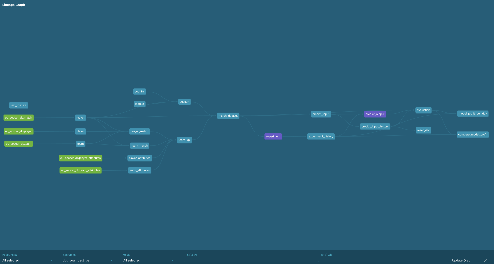

<a name="readme-top"></a>


<br />
<div align="center">
  <a href="https://github.com/devdnhee">
    
  </a>

<h1 align="center">🎲 Your Best Bet</h1>
   <div style="background: linear-gradient(90deg, #232526 0%, #414345 100%); color: #f8f8f2; border-radius: 10px; padding: 24px; margin: 24px 0; box-shadow: 0 2px 8px rgba(0,0,0,0.15); font-size: 1.1em;">
      <strong>
         A full-stack MLOps demo that predicts European football match outcomes using Python, dbt, and Databricks—combining data engineering, feature pipelines, and machine learning to find value bets and beat the bookies.
      </strong>
   </div>
</div>


## About The Project

Imagine a scenario of daily (or weekly) sports betting where you're on a quest to outsmart the bookies. This project houses a data warehouse simulation housing the [European Soccer Database](https://www.kaggle.com/datasets/hugomathien/soccer) date. Utilizing team and player statistics, performance metrics, FIFA stats, and bookie odds, we'll hunt down opportunities and place value bets.

Within the pipeline, you can:

- **Version Your Dataset**: run preprocessing to (re)generate your ML dataset
- **Experiment & Store**: run and save ML experiments
- **Model Management**: save and compare models
- **Reproducibility**: ensure inference pipelines run without train/serving skew (run simulations)
- **Feature Store**: house all input features with the available KPIs at that time
- **Prediction Audit**: maintain a log of all predictions


## Getting Started

### Prerequisites

* Python (>=3.11, tested until 3.12)
* Access to a Databricks cluster (e.g., [Azure free account](https://azure.microsoft.com/en-us/free))


### Installation (Databricks)

Manual setup:

1. install virtual environment
   ```bash
   virtualenv .venv
   source venv/bin/activate
   pip install -r requirements.txt

   # optional for contribution
   pip install -r requirements-dev.txt
   ```
2. Download data from [here]("https://www.kaggle.com/datasets/hugomathien/soccer/download?datasetVersionNumber=10") -> you need a Kaggle account. Drop the resulting `database.sqlite` file in the data folder.
3. Convert data to parquet and csv files
   ```bash
   python scripts/convert_data.py
   ```
4. Databricks
   1. [Create a SQL warehouse](https://docs.databricks.com/aws/en/compute/sql-warehouse/create)
   2. [Create a personal access token](https://docs.databricks.com/aws/en/dev-tools/auth/pat)
   3. [Upload data (parquet files)](https://docs.databricks.com/aws/en/ingestion/file-upload/) to your schema of choice
   4. Create a [compute cluster](https://docs.databricks.com/aws/en/compute/)
5. Setup environment / secrets, fill in the template in `env.templ` (rename as .env) and set the env vars (eg. `set -a && source .env`)
6. dbt setup
   1. initialise and install dependencies: `dbt deps`
   2. setup your [dbt profile](https://docs.getdbt.com/docs/core/connect-data-platform/connection-profiles), normally env vars have set it correctly so nothing needed here (`dbt_your_best_bet/profiles/profiles.yml`)
6. install `riskrover` python package, managed with poetry, on your compute
   1. build the package: `cd riskrover && poetry build`
   2. Install the resulting whl file (`riskrover/dist/riskrover-x.y.z-py3-none-any.whl`) on your databricks compute cluster: [Compute-scoped libraries](https://docs.databricks.com/aws/en/libraries/cluster-libraries)


You should now be able to run the pipeline without any trained models, eg. just the preprocessing:

```sh
dbt build --selector gold
```

<div style="background: linear-gradient(90deg, #ff9800 0%, #ffb74d 100%); color: #232526; border-radius: 8px; padding: 18px; margin: 24px 0; box-shadow: 0 2px 8px rgba(0,0,0,0.10); font-size: 1.05em;">
<strong>⚠️ NOTE</strong>
<p>The setup described above is manual and intended for demonstration purposes. For production deployments, consider the following best practices:
   <ul>
      <li><b>Infrastructure as Code:</b> Use tools like <a href="https://www.terraform.io/">Terraform</a> to provision Databricks clusters, manage accounts, networking, and other resources.</li>
      <li><b>Containerization & Orchestration:</b> Containerize your dbt environment (e.g., with Docker) and orchestrate workflows using tools like <a href="https://airflow.apache.org/">Apache Airflow</a>.</li>
      <li><b>Package and publish</b> <code>riskrover</code> to a private code repository, install dynamically on cluster within your CI/CD pipeline</li>
      <li><b>Secrets & Environment Management:</b> Manage secrets and environment variables securely using services such as <a href="https://docs.databricks.com/en/security/secrets/index.html">Databricks Secrets</a> or <a href="https://learn.microsoft.com/en-us/azure/key-vault/">Azure Key Vault</a>.</li>
      <li><b>CI/CD:</b> Implement continuous integration and deployment pipelines for automated testing and deployment, with Github Actions for example.</li>
   </ul>
</p>
</div>


<p align="right">(<a href="#readme-top">back to top</a>)</p>


<!-- USAGE EXAMPLES -->
## Usage

Explore and see how we could've made profit back in 2016 if we had access to this data at the right time :D.

### MWE simulation

The default variables are stored in `dbt_project.yaml`. We find ourselves on 2016-01-01 in our simulation, with the option to run until 2016-05-25.

```sh
cd dbt_your_best_bet

# Preprocessing
dbt build --selector gold

# Experimentation (by default -> training set to 2015-07-31, and trains a simple logistic regression with cross validation)
dbt build --selector ml_experiment

# Inference on test set (2015-08-01 -> 2015-12-31)
dbt build --selector ml_predict_run

# moving forward in time, for example with a weekly run
dbt build --vars '{"run_date": "2016-01-08"}'
dbt build --vars '{"run_date": "2016-01-15"}'
dbt build --vars '{"run_date": "2016-01-22"}'
...

# check if you made any money by compiling and running an analysis file
dbt compile -s analyses/compare_model_profit.sql
```

### Deep dive in Risk Rover
Analysis is available in `riskrover/notebooks/riskrover.ipynb`.

### Checking the data catalog

```sh
dbt docs generate
dbt docs serve
```

We can check the lineage:


### Cleanup

```sql
drop table if exists snapshots.predict_input_history;
drop table if exists snapshots.experiment_history;
```

then rebuild with `--full-refresh`

<!-- ROADMAP -->
## Roadmap

Mostly maintenance, no plans on new features unless requested.

- [ ] Extra documentation
- [ ] Data tests and unit tests
- [ ] Extra sql analysis


<!-- LICENSE -->
## License

Distributed under the MIT License.


<!-- CONTACT -->
## Contact
- devdnhee@gmail.com / dorian@dataroots.io


<p align="right">(<a href="#readme-top">back to top</a>)</p>
